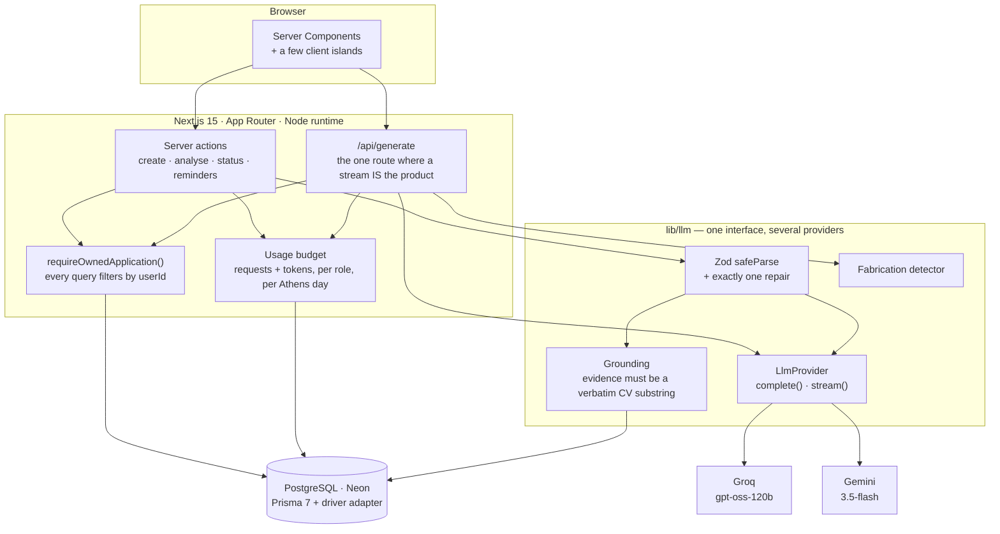

# Job Hunt Copilot

Paste a job ad and get an honest read on it: a match score against your own CV, every claimed
match backed by a verbatim quote from that CV, the gaps worth preparing for, and a cover letter
that addresses the biggest gap instead of pretending it isn't there.


## Live demo

**<https://job-hunt-copilot-gamma.vercel.app>**

| | |
|---|---|
| Email | `demo@example.com` |
| Password | `demo12345` |

The demo account is seeded with a profile, three applications, a stored analysis and a cover
letter, so you can see the product without spending any of the shared model budget. Registration
is open if you would rather use your own CV — you get 12 model calls a day.

<table>
<tr>
<td width="50%"></td>
<td width="50%"></td>
</tr>
<tr>
<td><strong>Today</strong> — what needs chasing, computed from the last activity on each application rather than from its created date.</td>
<td><strong>Insights</strong> — the patterns across every analysis. Below five analyses it says how many more are needed instead of drawing a line through noise.</td>
</tr>
</table>

## The problem

I applied to 12 jobs over six weeks. The applications lived in a spreadsheet, the job ads lived
in browser tabs, and the cover letters lived in a folder of near-identical `.docx` files. Three
things were genuinely hard, and none of them were the writing:

1. **Deciding whether an ad was worth the hour.** Every posting reads like it wants everything.
2. **Knowing what kept coming up.** After twelve applications I could not have told you which
   skill I was missing most often — the information was there, spread across twelve tabs.
3. **Not overselling.** The fastest way to write a cover letter is to let the ad's vocabulary
   pull you into claiming things you haven't done.

This app answers those three. The third one turned out to be the hard part, and most of the
engineering below exists because of it.

## Architecture



Three load-bearing decisions, out of eleven recorded in [SPEC.md](SPEC.md) §8:

- **The analysis is not streamed; the letters are.** A partial JSON object cannot be validated
  mid-stream, so analysis is a server action with a pending state. Prose has nothing to
  validate, so it streams — that is the only API route in the app.
- **`Analysis`, `Document` and `Event` carry a denormalized `userId`** and are queried by both
  `userId` and `applicationId`. An ESLint rule fails CI if anything outside `lib/applications/`
  touches those models directly.
- **Derived fields have exactly one writer.** `latestMatchScore` and `lastAnalyzedAt` are
  written only by the analyse action, in the same transaction as the `Analysis` row.

## What was hard

**The rate limiter that guarded the wrong door.** I put IP rate limiting in the sign-in server
action, wrote tests, and watched them pass. Then I tried to drive it with `curl` and realised
Auth.js also accepts a direct `POST` to `/api/auth/callback/credentials` — the path I had been
using all session to log in, and the path a credential-stuffing script would use. The limiter
was guarding the browser form and nothing else. It now lives inside `authorize()`, which is the
one place both routes cross; the test that proves it works signs in with the *correct* password
from a blocked IP and expects a refusal.

**One user's daily allowance was 2.5× the entire project's capacity.** Gemini's free tier caps
requests per *model* per day — I measured 20/day for `gemini-3.5-flash` — while the per-user
limit was set to 50 calls. A limit that cannot trip before the provider's wall does not protect
anything, and no amount of tuning that number would have helped. The fix started with measuring
instead of guessing: Groq's `openai/gpt-oss-120b` returns `x-ratelimit-limit-requests: 1000` with
an 86.4-second refill, and 86400/1000 = 86.4 tells you that bucket is per *day*. Fifty times the
capacity, so Groq became the deployed default and every budget was sized from the measurement.

**Prisma skips `undefined`, so clearing a field silently kept the old value.** An empty form
input arrives as `""`, which my schema turned into `undefined`, which Prisma treats as "don't
touch this column" rather than "set it to null". Clearing your location and saving showed the
old location again on reload — no error, no failed write, just the previous value calmly
persisting. The fix is to map blank optional fields to `null`, not `undefined`, and it had to be
applied to every form in the app once I understood it was a pattern rather than a bug.

**`\b` is ASCII-only, so the Greek fabrication detector never fired.** M5's detector looks for
first-person claims about skills the CV doesn't support, in English and Greek. Every pattern used
`\b` for word boundaries, and `\b` is defined on ASCII word characters — so it never matches
before a Greek letter, and every Greek pattern silently matched nothing. The suite was fully
green, because every case exercising those patterns had been written in English. The rule is now
in [CLAUDE.md](CLAUDE.md): any regex touching Greek uses the `u` flag and `(?<!\p{L})…(?!\p{L})`.
It caught a second instance in M9, where the eval recall metric would have scored "go" as found
in "mon**go**db".

**The model turned "learn Laravel" into "I am currently building in Laravel".** The analysis
produced a gap with the advice *"Build a complete CRUD application using Laravel"*. The cover
letter then contained *«αυτή την περίοδο αναπτύσσω μια πλήρη CRUD εφαρμογή με Laravel»* — "I am
currently developing a full CRUD application with Laravel". Nothing in the CV supports it, and it
is dangerous precisely because it sounds modest: a reader skims it as humility rather than as a
claim. It is now mitigated in three layers — the prompt names the failure mode, a detector flags
first-person present-tense claims about absent skills, and an eval fixture pins it — and none of
the three is sufficient alone, which is written down where the next person will read it.

**178 B of route JavaScript instead of a charting library.** The insights page has three
non-interactive charts. Recharts would have bought hover tooltips; instead the bar chart is a div
with a width percentage and the trend is a 40-line inline `<svg>`, both server-rendered, with
every value printed as text beside its bar or point. `/insights` ships **178 B** of
route-specific JavaScript and a 109 kB first load, against 156 kB for the application detail
page. The charts also read on a phone and in a screenshot, which is where a portfolio project is
usually seen.

**A local day is 23 or 25 hours, and dividing by 86,400,000 fires "due today" a day early.**
Europe/Athens is UTC+2 in winter and UTC+3 in summer. Subtracting two instants and dividing by
the number of milliseconds in a day is wrong twice a year — and wrong in the direction that makes
a reminder fire early, which is the direction users notice. All date logic lives in
[`lib/dates.ts`](lib/dates.ts) and works in civil dates, with 25 tests covering both 2026 DST
transitions, 23:59 versus 00:01 local, and an application created in one offset and read in
another. The same reasoning decided that usage counters roll over at Athens midnight: the message
says "resets at midnight", and it has to be the user's midnight or the sentence is a small lie.

## Eval results

Ten job ads against one real CV, on a pinned prompt version, so a prompt change produces a
comparison rather than an impression. `pnpm eval` reports schema validity, distance outside a
human-set score band, recall on skills the analysis must find, dropped claims, latency and
tokens. The CV is committed at [`evals/fixtures/_candidate.json`](evals/fixtures/_candidate.json)
so the run is reproducible. The ads are **synthetic** — written to a deliberate spread rather
than collected, because republishing third-party ad copy is not mine to do. The real postings
live in the app database, which is where the `analyze@1` → `analyze@2` comparison further down
came from.

Three things came out of running it. None of them is the pass rate.

### 1. The measurement is noisier than the thing it measures — and only on one provider

The first sweep scored 10/10 inside their bands, which looked like a result and was not. Running
the identical fixtures again moved five of ten scores, the largest by 15 points. A band that a
model can pass or fail depending on the sample is not measuring the prompt.

So the runner moved to **temperature 0** and grew `--runs N`, which reports the median and the
spread per fixture. The app stays at 0.2: it is writing prose for a person, where slight
variation reads as natural. An eval exists to answer "did this change anything", and cannot
if prompt effects and sampling noise arrive in the same number.

Temperature 0 did not fix it. It fixed one provider:

| | spread across 3 runs at temperature 0 |
|---|---|
| Gemini, all 10 fixtures | **0** — every fixture returned an identical score three times |
| Groq, `ai-engineer-rag-python` | **13** (55, 68, 65) |
| Groq, `data-engineer-spark` | 5 |
| Groq, `backend-node-greek-startup` | 0 |

`gpt-oss-120b` is a mixture-of-experts model and is not deterministic at temperature 0 the way
Gemini is. That is a property of the provider, not a knob to turn.

**What this means for anyone quoting eval numbers, mine included:** a single-run score from Groq
carries roughly ±13 points of noise, so no band narrower than about 26 points can be honest
there. Two of my fixtures were deliberately left un-tightened for exactly this reason — the
measurement does not support the precision the tighter band would imply. Quote a median over
several runs, quote the spread beside it, and treat any single number as an anecdote.

### 2. Groq and Gemini disagree about whether the CV contains C#

`dotnet-senior-five-years` exists to test one thing: the CV lists Unity and C# under game
development, and the ad wants C# for enterprise backend work. The right answer credits the
language and still names the missing ASP.NET and Azure ecosystem.

| | matched | score |
|---|---|---|
| Groq | `[]` — nothing at all | 15 |
| Gemini | `['C#']` | 15–25 |

Groq returned an empty `matchedSkills` array and listed C# as a gap. Gemini credited it. Same
CV, same prompt, same temperature.

This is a **provider-quality datapoint, not a prompt bug**, and it is deliberately not being
fixed with an `analyze@3`. A prompt rewritten until one provider stops making one mistake is a
prompt fitted to that provider, and the conformance suite exists precisely so the layer does not
quietly depend on one model's habits. It is recorded here instead.

The reverse case exists too, and it favours Groq. Gemini dropped 8 evidence quotes across 30
samples where Groq dropped 0 — quotes that read plausibly but were not verbatim in the CV, so
the grounding check discarded them. On two fixtures that is exactly why `react` shows as missed:
the skill was matched, its evidence was invented, and grounding removed it. Cheaper and more
deterministic, but looser with quotations.

### 3. Neither model produces a genuinely low score

Both deliberate mismatches — a Spark data-engineering role and a senior Kubernetes role, against
a junior fullstack CV with no overlap in either — land near the top of a 0–22 band:

| fixture | Groq | Gemini |
|---|---|---|
| `data-engineer-spark` | 20 | 15 |
| `senior-devops-kubernetes` | 20 | 10 |

A band ending at 15 would have failed both on Groq. The floor appears to sit around 20: the
model finds *something* creditable — Docker, SQL, "REST API design" — in a posting that shares
essentially nothing with the CV. For a tool whose job is to tell someone not to bother applying,
that is the number that matters, and it is the one the scoring prompt should be judged on next.

### The table

Gemini, 3 runs per fixture at temperature 0, from
[`evals/results/analyze-2-gemini.json`](evals/results/analyze-2-gemini.json):

Bands shown are the current ones. The saved run predates two of them being adjusted
(`ai-engineer-rag-python` 45–75 → 50–85, `wordpress-agency-greek` 18–48 → 18–40); neither change
moves a verdict, and the reasoning for each is in the fixture's own `notes`.

| fixture | band | median | spread | in band |
|---|---|---|---|---|
| `junior-fullstack-next-node` — the clear fit | 70–92 | 90 | 0 | yes |
| `backend-node-greek-startup` — Greek, genuine fit | 65–90 | 90 | 0 | yes |
| `frontend-react-testing-heavy` | 55–80 | 75 | 0 | yes |
| `ai-engineer-rag-python` | 50–85 | 68 | 0 | yes |
| `react-native-mobile-adjacent` | 28–58 | 45 | 0 | yes |
| `enterprise-fullstack-long-posting` | 25–55 | 25 | 0 | yes, at the floor |
| `dotnet-senior-five-years` | 8–35 | 25 | 0 | yes |
| `data-engineer-spark` — clear mismatch | 0–22 | 15 | 0 | yes |
| `senior-devops-kubernetes` — clear mismatch | 0–22 | 10 | 0 | yes |
| `wordpress-agency-greek` — Greek, partial | 18–40 | 65 | 0 | **no** |

| | Gemini, 3 runs, temp 0 |
|---|---|
| Schema-valid, of answers received | 28/28 |
| Median inside band | 9/10 |
| `mustFindSkills` recall | 77% |
| `mustFlagGaps` recall | 96% |
| Dropped evidence quotes | 8 |
| Samples that never answered | 2 (quota) |
| Repairs needed | 0 |
| Gap entries that were phrases, not skills | 0 |
| Mean latency / tokens | 11.7s / 2,509 |
| Fabrication regression case | clean |

The one failure is the intended kind. `wordpress-agency-greek` scores 65 against a band of
18–40 — a WordPress agency role held by someone with no WordPress, WooCommerce or MySQL. The
band was tightened *after* seeing that score, not to accommodate it. It records a disagreement
with the model rather than a target the model met.

The Greek pair is the language control: a Greek ad that genuinely fits scored 90, a Greek ad
that partly fits scored 65, both in line with their English counterparts. Language is not the
variable.

**Not in this table:** a complete Groq sweep at temperature 0. Groq enforces a 200,000
tokens-per-day ceiling that appears in no response header — it announced itself by rejecting the
three-run sweep partway through, after 8 of 30 samples. The Groq column above is drawn from
those 8 plus an earlier complete run at temperature 0.2. Finishing it needs another day's quota.

### `analyze@1` → `analyze@2`: the gap-granularity fix

v1 produced faithful readings of each ad that were useless in aggregate. Because a gap could be a
whole requirement, no two postings ever produced the same gap, every count on the insights page
was 1, and the chart flattened into a list. v2 requires one named skill per gap and routes
non-skill requirements to `redFlags`.

Both versions run over the same three applications:

| | `analyze@1` | `analyze@2` |
|---|---|---|
| Gap entries | 6 | 16 |
| …that were requirement sentences, not skills | **3 (50%)** | **0** |
| `redFlags` entries | 5 | 6 |
| Gap entries repeating across applications | 0 | — |

What changed, concretely:

| v1 gap | v2 |
|---|---|
| `PixiJS, Webpack, Gulp, WebAudio` | four entries: `PixiJS`, `Webpack`, `Gulp`, `WebAudio` |
| `3-5 Years of Web Development Experience` | moved to `redFlags`: "3–5 years of experience required" |
| `Moodle or other educational platforms (LMS)` | `Moodle` |

Every `analyze@1` row was kept. The prompt version is stored on each `Analysis`, so the two
populations stay distinguishable and the before/after above is reproducible from the database.

One caveat, stated rather than buried: match scores also moved (45→30, 35→55, 75→80). Those
changes are *not* evidence of improvement — a different prompt scores differently, and the
comparison is confounded by design. Prompt versioning exists so that change is deliberate and
visible, not so it can be claimed as progress.

### Regression fixture

| fixture | provider | result | tokens | latency |
|---|---|---|---|---|
| `no-fabricated-bridge` | groq / gpt-oss-120b | clean — 0 fabricated claims | 1,148 | 1.3s |

### `reasoning_effort` on prose

`gpt-oss-120b` reasons before answering. On a cover letter that reasoning was most of the bill:

| | completion tokens | of which reasoning | total | latency |
|---|---|---|---|---|
| default | 972 | 824 | 1,722 | 2.4s |
| `low` | 183 | 36 | **933** | **0.8s** |

Same letter quality, both clean of fabricated claims, 702 versus 725 characters of output. Set to
`low` for `stream()` only — the structured analysis keeps full reasoning, which is the same split
as disabling Gemini's thinking budget for prose in M4.

### Client bundles

Largest first-load JavaScript, and the 150 kB rule I set myself:

| route | first load | note |
|---|---|---|
| `/applications/new`, `/applications/[id]/edit` | 157 kB | over |
| `/applications/[id]` | 156 kB | over |
| `/profile` | 154 kB | over |
| `/today` | 119 kB | |
| `/insights` | 109 kB | three charts, 178 B of route JS |
| `/usage` | 102 kB | framework floor only |

102 kB of that is the shared React 19 and App Router runtime, present on every route and not
reducible without leaving the framework. The four routes over the line are the form-heavy ones:
they add roughly 52–55 kB for controlled inputs, `useActionState` and the Base UI primitives the
selects are built on. That is the honest accounting rather than a pass — the number to beat is
the ~55 kB, and the lever would be replacing the select primitives with native controls.

## Running locally

Requires Node 22 (`.nvmrc` pins 22.22.2) and pnpm.

```bash
pnpm install
cp .env.example .env          # then fill in DATABASE_URL, DIRECT_URL, AUTH_SECRET
pnpm exec prisma migrate dev  # create the schema
pnpm exec tsx prisma/seed.ts  # demo@example.com / demo12345, with example data
pnpm dev
```

`AUTH_SECRET` wants `openssl rand -base64 32`. For the model layer set `GROQ_API_KEY` (the
default provider) or `GEMINI_API_KEY` with `LLM_PROVIDER=gemini`; `.env.example` documents both
profiles and every budget knob. GitHub sign-in is optional — leave `AUTH_GITHUB_ID` and
`AUTH_GITHUB_SECRET` empty and the button hides itself.

```bash
pnpm typecheck && pnpm lint && pnpm test   # the gate
pnpm test:e2e                              # Playwright, LLM mocked, real database
pnpm eval --dry-run                        # validate fixtures and print the cost
pnpm eval --provider groq                  # spend real quota
```

### Stack

Next.js 15 (App Router, TypeScript strict) · React 19 · Prisma 7 + PostgreSQL (Neon) ·
Auth.js v5 · Zod 4 · Tailwind + shadcn/ui · Vitest + Playwright · Vercel + GitHub Actions.

Zod schemas are the single source of truth: form validation, environment validation, the JSON
schema sent to the model, and the TypeScript types all derive from them.
